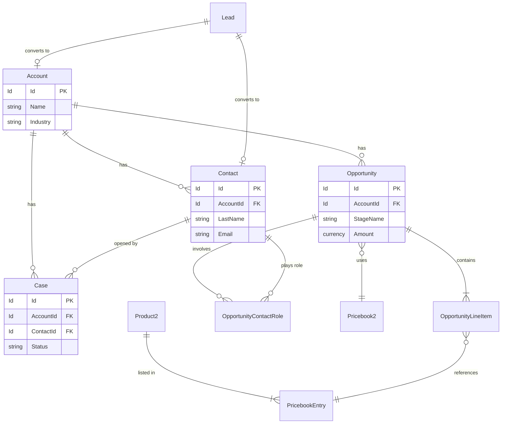
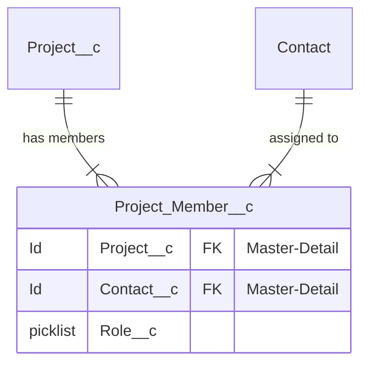
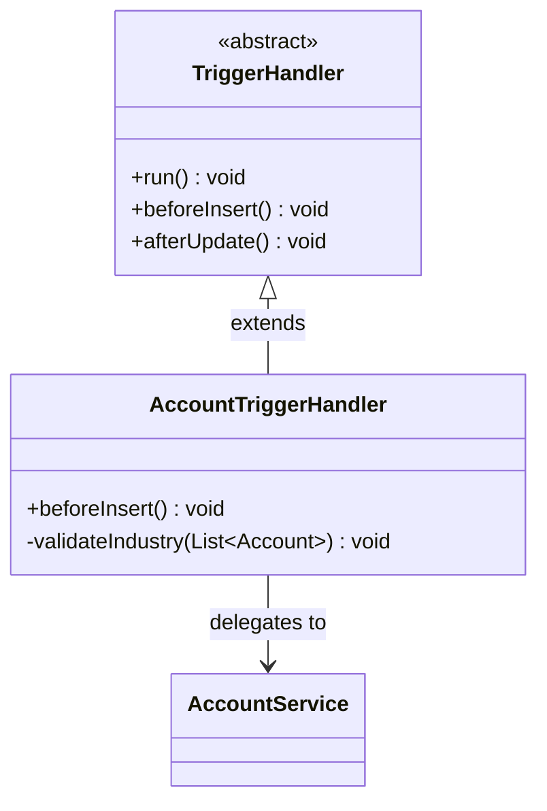
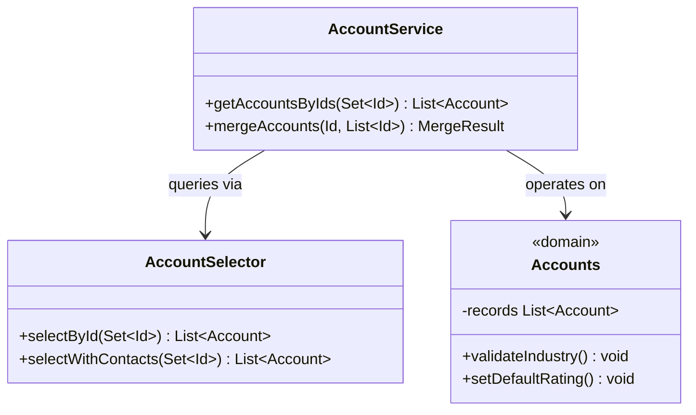
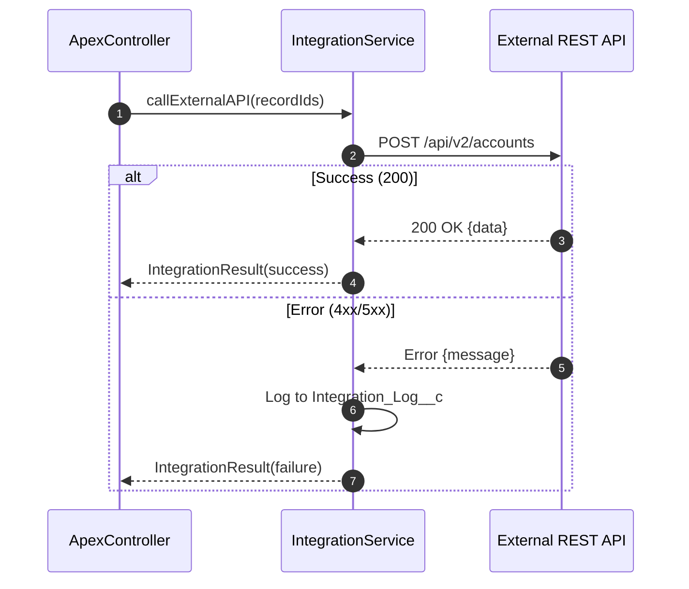
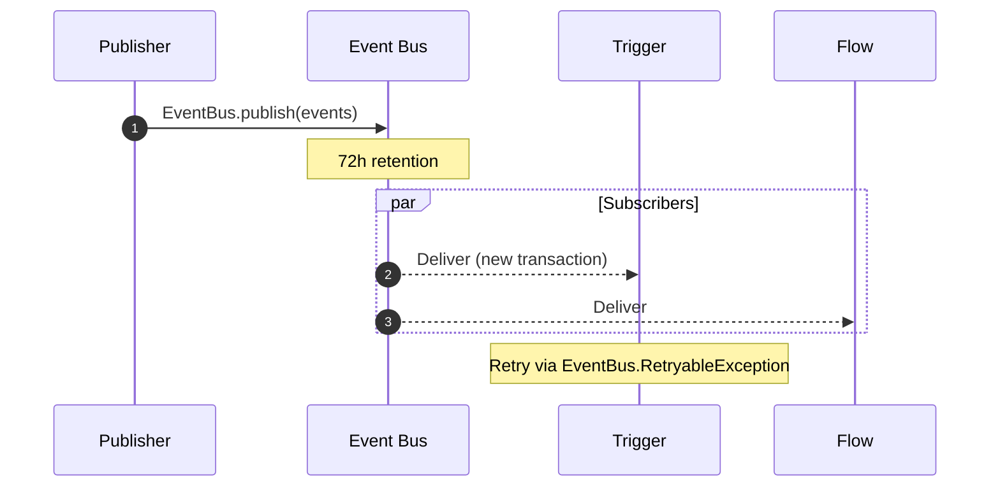
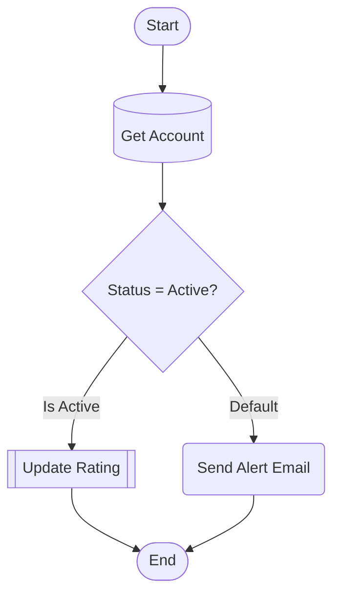
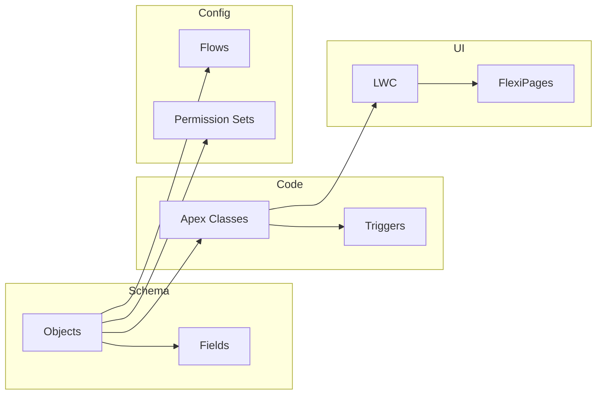

# Diagram Reference: Templates, Examples & Syntax

Reusable templates and patterns for generating Salesforce architecture diagrams in Mermaid and ASCII.

---

## ERD Templates

### Standard Sales Cloud Data Model



### Custom Object Junction Pattern



---

## Class Diagram Templates

### Trigger Handler Pattern



### Service-Selector-Domain Pattern



---

## Sequence Diagram Templates

### REST Callout with Error Handling



### Platform Event Pub/Sub



---

## Flow-to-Mermaid Conversion Rules

### XML Element Mapping

| Flow XML Tag | Mermaid Shape | Syntax |
|-------------|--------------|--------|
| `<start>` | Start node | `([Start])` |
| `<screens>` | Screen | `[/Screen Name/]` |
| `<decisions>` | Decision | `{Decision?}` |
| `<assignments>` | Assignment | `[Set Variables]` |
| `<recordLookups>` | Query | `[(Get Records)]` |
| `<recordCreates>` | DML | `[[Create Record]]` |
| `<recordUpdates>` | DML | `[[Update Record]]` |
| `<recordDeletes>` | DML | `[[Delete Record]]` |
| `<loops>` | Loop | `{For Each Item}` |
| `<actionCalls>` | Action | `(Invoke Action)` |
| `<subflows>` | Subflow | `[[Run Subflow]]` |
| `<waits>` | Wait | `{{Wait for Event}}` |

### Connector Mapping

| Flow Connector | Mermaid Syntax |
|---------------|---------------|
| `<connector>` | `A --> B` |
| `<defaultConnector>` | `A -->\|Default\| B` |
| `<faultConnector>` | `A -.->\|Fault\| B` |
| `<nextValueConnector>` | `A -->\|Next Item\| B` |
| `<noMoreValuesConnector>` | `A -->\|Done\| B` |

### Conversion Example



---

## Deployment Dependency Graph Template



---

## Mermaid Syntax Cheat Sheet

### erDiagram Relationships

```
    A ||--|| B    One to one (exact)
    A ||--o{ B    One to many (Lookup)
    A ||--|{ B    One to many (Master-Detail)
    A }o--o{ B    Many to many (via junction)
    A }o--|| B    Many to one (optional)
```

### classDiagram Relationships

```
    A <|-- B      Inheritance (extends)
    A <|.. B      Implementation (implements)
    A *-- B       Composition (strong ownership)
    A o-- B       Aggregation (weak ownership)
    A --> B       Association (uses)
    A ..> B       Dependency (depends on)
```

### Styling Nodes

```
classDef standard fill:#1b96ff,stroke:#0176d3,color:#fff
classDef custom fill:#06a59a,stroke:#04877a,color:#fff
classDef external fill:#ff6b6b,stroke:#d63d3d,color:#fff
```

### Transaction Boundary — use `rect` blocks in sequence diagrams:

```
rect rgb(240, 248, 255)
    Note over A,C: Transaction 1
end
rect rgb(255, 240, 240)
    Note over D,E: Async context
end
```

---

## ASCII Fallback Templates

### ERD (ASCII)

```text
+-------------+  1:N  +-------------+  N:1  +------------------+
|   Account   |------>|   Contact   |------>|   Opportunity    |
+-------------+       +-------------+       +------------------+
| Id (PK)     |       | AccountId   |       | AccountId (FK)   |
| Name        |       | LastName    |       | StageName        |
| Industry    |       | Email       |       | Amount           |
+-------------+       +-------------+       +------------------+
```

### Sequence (ASCII)

```text
  LWC           Controller     Service        External API
   |               |              |               |
   |--callApex---->|              |               |
   |               |--process---->|               |
   |               |              |--HTTP POST--->|
   |               |              |<--200 OK------|
   |               |<--result-----|               |
   |<--response----|              |               |
```

### Class Hierarchy (ASCII)

```text
  TriggerHandler (abstract)
  +-- AccountTriggerHandler --> AccountService --> AccountSelector
  +-- OpportunityTriggerHandler --> OpportunityService
  +-- CaseTriggerHandler --> CaseService
```

---

## Tips

- Start simple, drill down on request
- Use real Salesforce API names, not display labels
- Annotate governor limits (SOQL/DML counts) and async boundaries
- Label relationships with verbs: "has", "belongs to", "references"
- Test rendering in GitHub markdown or Mermaid live editor
- Max 30 entities per ERD, 100 nodes per diagram; split by domain
- Colors: blue for standard, green for custom, red for external
